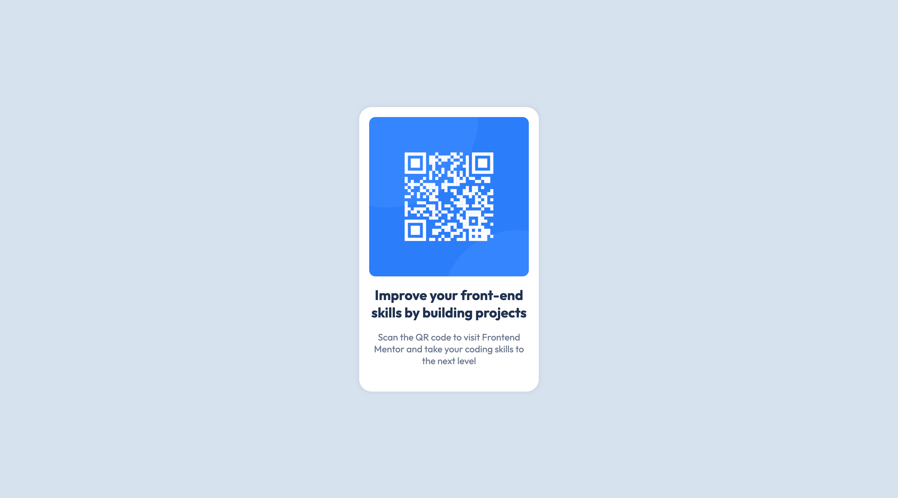

# Frontend Mentor - QR code component solution

This is a solution to the [QR code component challenge on Frontend Mentor](https://www.frontendmentor.io/challenges/qr-code-component-iux_sIO_H). Frontend Mentor challenges help you improve your coding skills by building realistic projects. 

## Table of contents

- [Overview](#overview)
  - [Screenshot](#screenshot)
  - [Links](#links)
- [My process](#my-process)
  - [Built with](#built-with)
  - [What I learned](#what-i-learned)
  - [Useful resources](#useful-resources)
- [Author](#author)
- [Acknowledgments](#acknowledgments)

**Note: Delete this note and update the table of contents based on what sections you keep.**

## Overview

### Screenshot

#### Mobile

#### Desktop

### Links

- Solution URL: [Add solution URL here](https://your-solution-url.com)
- Live Site URL: [https://walterfurrer.github.io/qr-code-component-main/](https://walterfurrer.github.io/qr-code-component-main/)

## My process

### Built with

- Semantic HTML5 markup
- CSS custom properties
- Flexbox
- Mobile-first workflow

### What I learned

It's been a minute since I've used plain 'ol CSS. I usually reach for Tailwind at this point. Remembering some of the syntax proved to be tricky. Thankful for MDN!

### Useful resources

- [Border Radius Calculator](https://borderradiuscalculator.vercel.app/) - A nifty tool that helps you figure out proper border radii.

## Author

- Website - [Walter Furrer](https:https://www.walterfurrer.com/)
- Frontend Mentor - [@walterfurrer](https://www.frontendmentor.io/profile/walterfurrer)
- X/Twitter - [@waltercodes](https://x.com/waltercodes)\

## Acknowledgments

Shoutout to my brother and (sometimes reluctant) mentor [Ryan Furrer](https://www.ryanfurrer.com/). It's nice to have a Design Engineer that I can go to when I know something is off, but I just *don't know what*.
